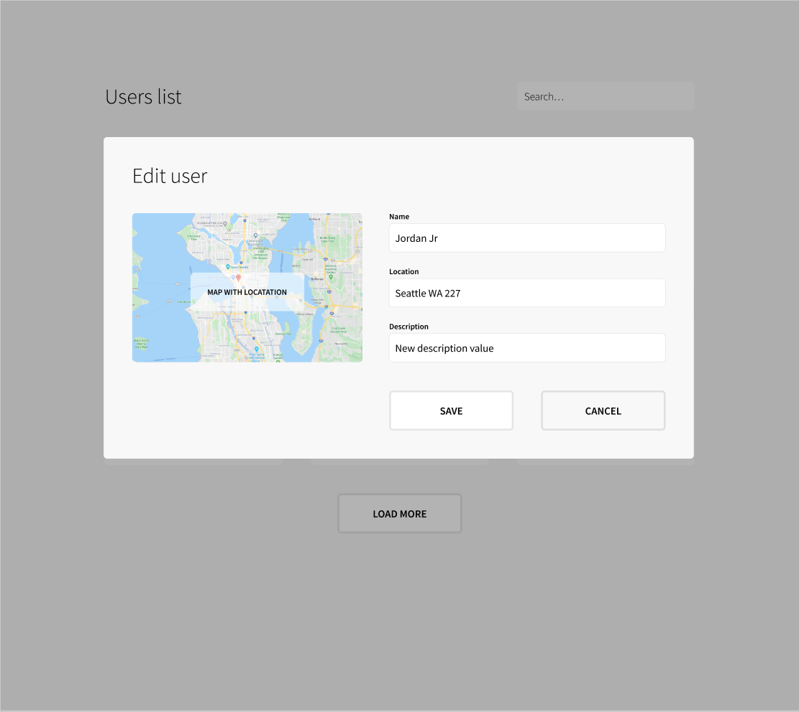

# Superformula Cloud Backend Test

Be sure to read **all** of this document carefully, and follow the guidelines within.

## Branching strategy

1. Create a branch from `main` to implement your solution
2. Once you are done, open a PR from your development branch to `main` and let us know about it

## What you will be building

Build a GraphQL API that can `create/read/update/delete` user data from a persistence store.


### User Model

```
{
  "id": "xxx",                  // user ID (must be unique)
  "name": "backend test",       // user name
  "dob": "",                    // date of birth
  "address": "",                // user address
  "description": "",            // user description
  "createdAt": "",              // user created date
  "updatedAt": "",              // user updated date
  "imageUrl": ""                // user avatar image url
}
```

### Requirements

#### Functionality

- The API should follow typical GraphQL API design pattern
- The data should be saved in the DB
- Proper error handling should be used
- Paginating and filtering (by name) users list
- The API must have a Query to fetch geolocation information based off an address
- An online interactive demo with a publicly accessible link to your API must be available so we can test the functionality

#### Tech Stack
  - **Use Typescript**
  - **Use Terraform to deploy all resources to an AWS account.**
  - Use **AWS AppSync**
  - Use any AWS Database-as-a-Service persistence store. **DynamoDB is preferred.**
  - Location query must use [NASA](https://api.nasa.gov/) or [Mapbox](https://www.mapbox.com/api-documentation/) APIs to resolve the coordinate based on the address; use AWS Lambda.

#### Developer Experience 
- Write unit tests for business logic
- Write concise and clear commit messages
- Document and diagram the architecture of your solution
- Write clear documentation:
    - Repository structure
    - Environment variables and any defaults.
    - How to build/run/test the solution
    - Deployment guide
    
#### API Consumer Experience
- GraphQL API documentation
- Ensure your API is able to support all requirements passed to the consumer team

### Bonus

These may be used for further challenges. You can freely skip these; feel free to try out if you feel up to it.

#### Developer Experience (in order)

1. E2E Testing
1. Integration testing
1. Code-coverage report generation
1. Describe your strategy for Lambda error handling, retries, and DLQs
1. Describe your cloud-native logging, monitoring, and alarming strategy across all queries/mutations
1. Brief description of the frameworks/tools used in the solution
1. Optimized lambda build.
1. Commit linting
1. Semantic release


#### API Consumer Experience (in order)

1. Document how consumers can quickly prototype against your APIs
    - GraphQL Playground setup
    - Insomnia setup
    - Feel free to use any other tool/client you might know that enable consumers to prototype against your API
1. GraphQL Documentation Generation
1. Client API generation


## Frontend Wireframes/Mockups (Do not implement those screens)

Assume the GraphQL API you are developing will be used by a hypothetical front-end team to build the following screens:




> [Source Figma file](https://www.figma.com/file/hd7EgdTxJs2fpTzzSKlNxo/Superformula-full-stack-test)

- Client will be performing real-time search against this API
- List of users should be updated automatically after single user is updated

## What We Care About

Use any libraries that you would normally use if this were a real production App. Please note: we're interested in your code & the way you solve the problem, not how well you can use a particular library or feature.

_We're interested in your method and how you approach the problem just as much as we're interested in the end result._

Here's what you should strive for:

- Good use of current Typescript, Node.js, GraphQL & performance best practices.
- Solid testing approach.
- Extensible code and architecture.
- Delightful experience for other backend engineers working in this repository
- Delightful experience for engineers consuming your APIs

## Q&A
> Where should I send back the result when I'm done?

Send us a pull request when you think you are done. There is no deadline for this task unless otherwise noted to you directly.

> What if I have a question?

Create a new issue [in this repo](https://github.com/Superformula/cloud-backend-test/issues) and we will respond and get back to you quickly.

> Should I validate inputs?

Please assume a hard requirement has not been set by the product owner. We welcome any input validations and your reasoning for why they add value.

> What is the location format?

Examples:
- Seattle, Washington
- Digital Nomad
- New Jersey
- Northern Bergen County, NJ

> I almost finished, but I don't have time to create everything what is required

Please provide a plan for the rest of the things that you would do.
